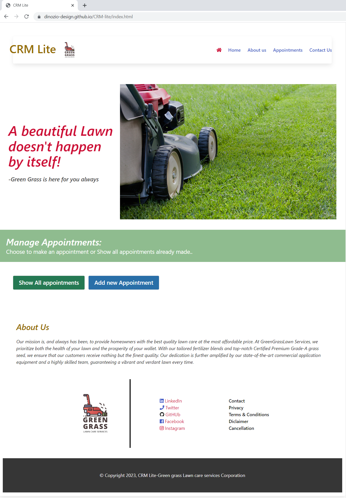

# Group Project 1 - TBD | Interactive Front-End Application
### From Scratch — to build a CRM-lite
<br>

## Description

In this group project we have created a web application from scratch! 

A CRM-lite is a  Green Grass Lawn Care Services for employees to book appointment in order to have fastest lawn services and  provide excellent customer lawn care services experience. This app uses 3rd party API's such Weather API and Canadian holiday api.This API is used to check if weather is sunny on appoitment date and Canadian Holiday is used to check to make sure there is no Canadian Fedral Holiday on the day of appointment because we are off that day
his app runs in the browser and features dynamically updated HTML and CSS powered by JavaScript code that we wrote and polished together as a team. It has a clean, polished, and responsive user interface. 

Way to go TEAM 4 🙏👍

## User Story

```

As a  Green Grass Lawn Care Services
I WANT to be able to create new appointments with customer information such as location [address] time-slot and dat of appointment, as well as local weather forecast. 
SO THAT I can have quick access to all appointments organized in a manner to be delivered according to the date and time. And I can see the list of appointments and go to my scheduled appointment on time and at the correct address!
```


## Acceptance Criteria

```
GIVEN a CRM app with project management
WHEN I click add new appointment button
THEN I am presented with new appointment page
WHEN I see the form page displays
THEN I can interact with them and input the information for new appointment
WHEN I click Confirm  button
THEN I will displays with weather information
WHEN I choose appointment date on Canadian Fedral Holidays 
THEN I will displays wih the message that It is a Canadian Fedral Holiday
WHEN I click Confirm button
THEN the appointment information is saved to local storage 
WHEN I open Show all appointments page
THEN I am presented with the appointment details [such as address, date, time, etc.]
WHEN I am presented with the appointment details, 
THEN I can also see the weather forecast for that appointment address.
WHEN I click About us  
THEN I will directed to About us Information
WHEN I click Contact 
THEN I will directed to Contact Information
```


## Mockup

The following animation shows the web application's appearance and functionality:




## Our Work
We have great Experience working together in a team .Great Team
Here is a breakdown for our CRM-lite app:<br>
HTML framework for all the pages has been presented by : Vithusan Uruthirakumaran <br>
CSS styling,CSS framework:Bulma ,and also rendering information to display on html pages has been presented by Alekhya erikipati<br>
Fetching Weather api and also Canadian Fedral Holidays are presented by  Rajni bala<br>
Storing Project details in local storage is presented by Saeid Azimi-Moghadam <br>
Presentation is been created by  Vithusan Uruthirakumaran and  Alekhya erikipati<br>
Stitch different files to ones has been doe by Saeid Azimi-Moghadam<br>
README file has been created by  Rajni bala<br>

## Deployed Application:
1. You can find the URL of our deployed application here:<br>
https://dinozio-design.github.io/CRM-lite/


2. You can find the URL of our GitHub repository that contains this code here:<br>
https://github.com/dinozio-design/CRM-lite

## License
MIT License

## References
We used files and resources provided by BCS : GitLab repo UTOR-VIRT-FSF-PT-04-2023-U-LOLC
We used OpenWeatherMap to fetch weather api ,You can find it here:<br>
https://openweathermap.org/
We used Canadian Holidays API website to fetch Canadian Fedral Holidays ,You can find it here:<br>
https://canada-holidays.ca/api
We used CSS framework:Bulma ,You can find it here:<br>
https://bulma.io/

- - -


### Authors Notes:<br>
_This README and accompanying repo have been brought to you by:<br>
Rajni Bala<br>Saeid Azimi-Moghadam<br>Vithusan Uruthirakumaran<br>Alekhya erikipati<br>
© Group 4- 2023 CodeCamp Studens.<br> 
Confidential and Proprietary. All Rights Reserved.